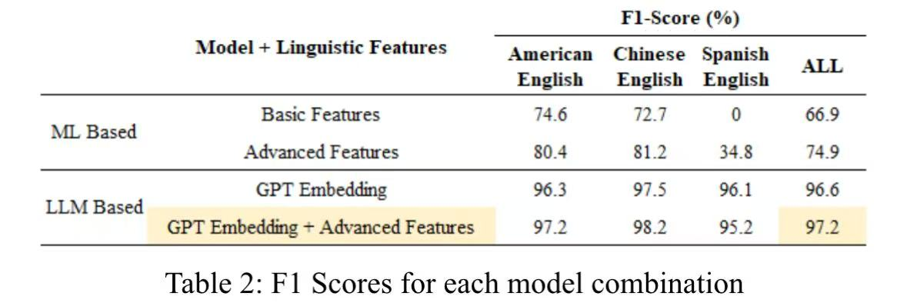
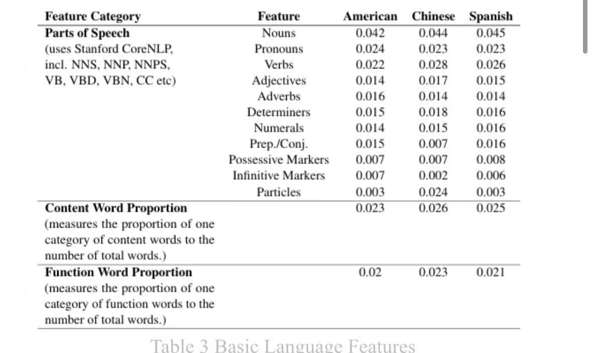
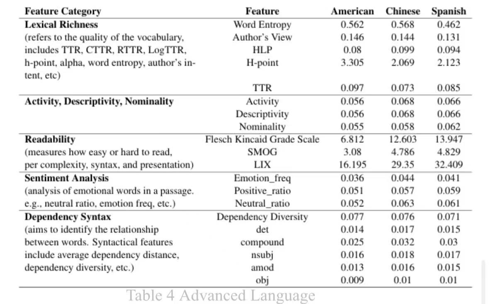

# English Variants
A Corpus-Based Profiling of Regional English Variants in Global Media: Insights from Olympic Journalism

---
## Corpus

We focused on Olympic news in American English, Chinese English, and Spanish English. On one hand, American English represented the standard variety of English in native-speaking countries, Chinese English served as a prototypical non-native variety, and Spanish English occupied an intermediate position, characterized by a strong linguistic community and long-term contact and integration with English. On the other hand, The accessibility of relevant corpora for these three varieties of English was greater, and the scale of publicly available data was also larger. We utilized Python web scraping techniques to crawl Olympic news from The New York Times (representing American English), China Daily (representing Chinese English,) and a combination of Sur in English, TicoTimes, and Mexican News Daily sources (representing Spanish English). These newsletter outlets were selected because each of these outlets was considered the most representative and popular within their respective countries. The crawled corpus under analysis consisted of 780 English news from The New York Times, 704 English news from China Daily, and 326 English news from a combination of Sur in English, TicoTimes, and Mexican News Daily sources. The time range of these articles was from 2020 to 2023, and all articles were obtained from public sources. After that, each article was preprocessed by performing tokenization, part-of-speech tagging, and dependency parsing with Stanford CoreNLP through Python to prepare the data for feature extraction and modeling.

1. Download the corpus `OlympicSports.xlsx`
2. Download the tokenized data `labeled_data.json.zip`
---
## Quantitative Metric Formula
Download `formula docx`

---
## Results

